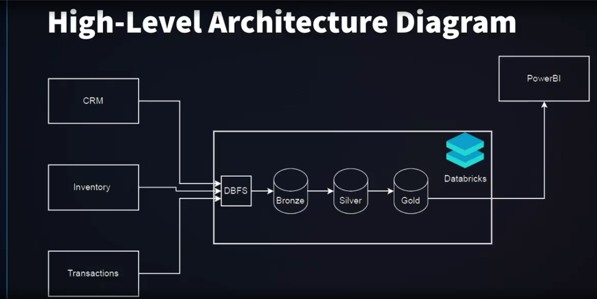
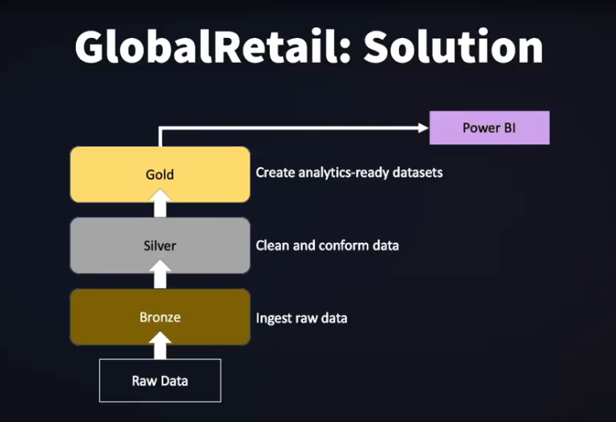
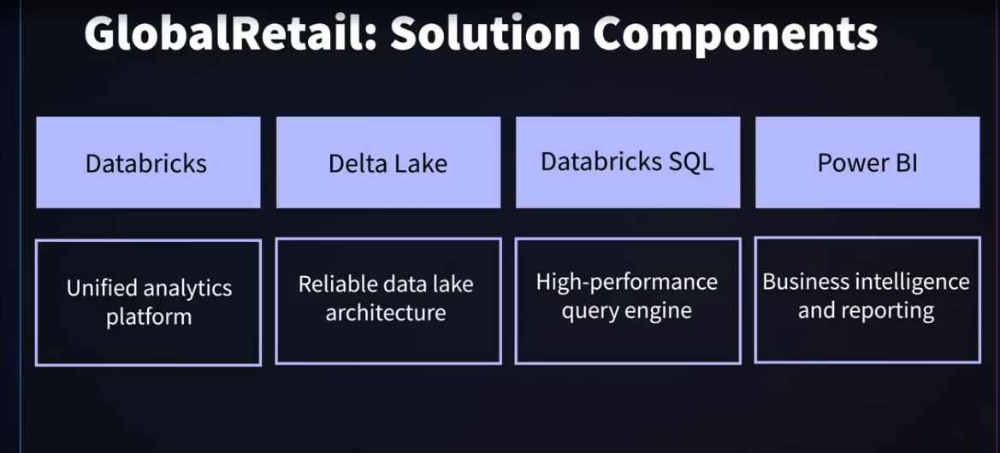

# GlobalRetail: End-to-End Data Engineering Project with Databricks

  

## 📋 Project Overview

This project demonstrates an end-to-end data engineering solution for **GlobalRetail**, a multinational retail corporation operating in 27 countries with over 11,000 stores and a robust e-commerce platform. The solution implements a modern **data lakehouse architecture** using Databricks to address GlobalRetail's data consolidation and analytics challenges.

### 🎯 Business Objectives

- **Reduce data processing time** from 72 hours to under 6 hours
- **Improve inventory forecasting accuracy** by 25%
- **Increase customer personalization** leading to 15% boost in repeat purchases
- **Enable near real-time financial reporting** across all regions

## 🏢 Company Profile: GlobalRetail

- **Scale**: 27 countries, 11,000+ stores
- **Platform**: Robust e-commerce presence
- **Data Volume**: Massive daily data generation
- **Challenge**: Struggling with data consolidation and effective analysis

## 📊 Data Sources

| Data Source | Format | System | Volume |
|-------------|--------|---------|---------|
| **Customer Data** | CSV Files | CRM System | ~500 million records |
| **Product Catalog** | JSON Files | Inventory Management | ~500K SKUs |
| **Transaction History** | Parquet Files | POS & E-commerce | ~10 billion annual transactions |

## 🚧 Business Challenges

### Data Quality Issues
- Legacy records from older systems
- Inconsistent data from acquired companies
- Varying data schemas across countries

### Technical Challenges
- **Multiple data formats**: CSV, JSON, Parquet
- **Complex ETL processes**: Currency alignment, timezone handling, regional product codes
- **Scalability**: Processing historical and real-time data efficiently

## 🏗️ Solution Architecture

### Three-Layer Data Lakehouse Architecture


```
Raw Data Sources → Bronze Layer → Silver Layer → Gold Layer → Power BI
     ↓               ↓             ↓            ↓          ↓
   CSV/JSON/      Raw Data      Clean &      Business    Reports &
   Parquet        Ingestion    Transform    Analytics    Dashboards
```

#### 🥉 Bronze Layer (Raw Ingestion)
- **Purpose**: Store raw data exactly as received
- **Benefit**: Data auditability and reprocessing capability
- **Format**: Original format preservation (CSV, JSON, Parquet)

#### 🥈 Silver Layer (Clean & Transform)
- **Purpose**: Apply data quality rules and transformations
- **Features**:
  - Schema evolution handling
  - Data quality validation
  - Data masking for sensitive information (PII, account numbers)
- **Output**: Clean, standardized data

#### 🥇 Gold Layer (Business Analytics)
- **Purpose**: Business-level aggregates and optimized data models
- **Features**:
  - Use case-specific data models
  - Query performance optimization
  - Analytics-ready datasets
- **Consumers**: Power BI, business users

## 🛠️ Technology Stack

| Component | Purpose | Benefits |
|-----------|---------|----------|
| **Databricks** | Unified analytics platform | Scalable data processing and ML capabilities |
| **Delta Lake** | Reliable data lake storage | ACID transactions, time travel, schema evolution |
| **Databricks SQL** | High-performance query engine | Fast analytics and SQL-based queries |
| **Power BI** | Business intelligence | Interactive dashboards and reporting |

## 📈 Solution Benefits

### Scalability
- Handle 5+ years of historical data
- Process growing data volumes efficiently

### Flexibility
- Accommodate various data formats from multiple countries
- Support different regional requirements

### Data Governance
- User-based access controls
- Data lineage and auditability

### Performance
- Fast query performance for analytics
- Optimized data storage and retrieval

### Cost Effectiveness
- Eliminate need for separate systems for different data types
- Unified platform for all data operations

## 🚀 Getting Started

### Prerequisites
- Databricks workspace
- Azure/AWS account (depending on cloud provider)
- Power BI Pro license
- Basic knowledge of SQL and Python/Scala

### Setup Instructions

1. **Clone the Repository**
   ```bash
   git clone https://github.com/EmilioMonteLuna/End-to-End-DE-Global-Retail.git
   cd End-to-End-DE-Global-Retail
   ```

2. **Databricks Environment Setup**
   - Create a Databricks workspace
   - Set up compute clusters
   - Configure storage accounts

3. **Data Ingestion**
   - Run Bronze layer notebooks to ingest raw data
   - Verify data landing in Delta tables

4. **Data Processing**
   - Execute Silver layer transformations
   - Apply data quality rules

5. **Analytics Layer**
   - Create Gold layer aggregations
   - Build business-specific data models

6. **Visualization**
   - Connect Power BI to Databricks SQL
   - Create dashboards and reports

## 📁 Project Structure

```
End-to-End-DE-Global-Retail/
├── notebooks/
│   ├── bronze/          # Raw data ingestion
│   ├── silver/          # Data cleaning and transformation
│   └── gold/            # Business analytics layer
├── dashboards/          # Power BI dashboard files
```

## 🔧 Implementation Phases

### Phase 1: Data Ingestion (Bronze Layer)
- Set up data landing zones
- Implement raw data ingestion pipelines
- Configure Delta Lake storage

### Phase 2: Data Processing (Silver Layer)
- Develop data quality frameworks
- Implement transformation logic
- Handle schema evolution

### Phase 3: Analytics (Gold Layer)
- Create business data models
- Optimize for query performance
- Build aggregated views

### Phase 4: Visualization & Reporting
- Develop Power BI dashboards
- Create automated reporting
- Set up alerts and monitoring

## 📊 Key Metrics & KPIs

- **Data Processing Time**: Target < 6 hours (from 72 hours)
- **Data Quality**: 99%+ accuracy rate
- **Query Performance**: Sub-second response for standard queries
- **System Availability**: 99.9% uptime SLA

## 🤝 Contributing

1. Fork the repository
2. Create a feature branch (`git checkout -b feature/AmazingFeature`)
3. Commit your changes (`git commit -m 'Add some AmazingFeature'`)
4. Push to the branch (`git push origin feature/AmazingFeature`)
5. Open a Pull Request

## 📝 License

This project is licensed under the MIT License - see the [LICENSE](LICENSE) file for details.

## 👨‍💼 Project Author

**Emilio Montelongo Luna**
- GitHub: [@EmilioMonteLuna](https://github.com/EmilioMonteLuna)
- LinkedIn: [Connect with me](https://linkedin.com/in/Emilio-Montelongo-Luna)

## 🙏 Acknowledgments

- Deepak Goyal - Course Instructor and Microsoft Solution Architect
- Databricks Community for best practices and documentation
- GlobalRetail case study for real-world context

---

*This project is part of a comprehensive Data Engineering course focusing on practical implementation of modern data lakehouse architectures using Databricks.*
